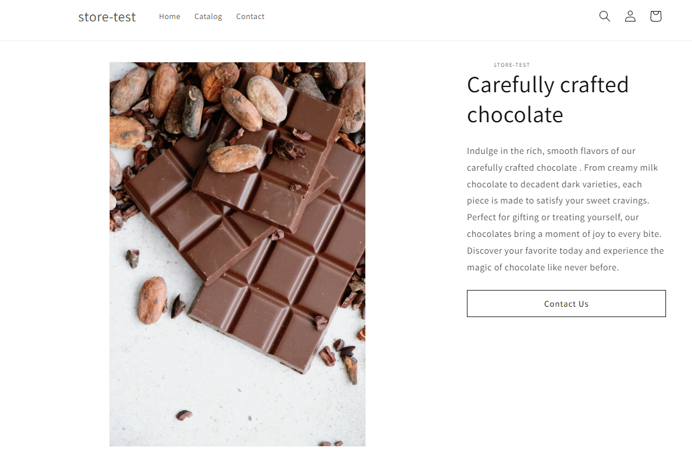
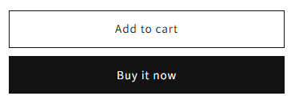
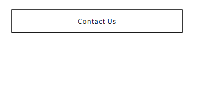
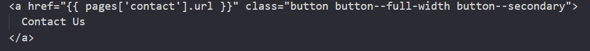

# Shopify Contact Button

A reusable Shopify snippet that adds a styled “Contact Us” button.  
It’s designed to maintain consistent sizing and placement across collections or sections, regardless of image height or container structure.

---

## 📸 Preview

### Full layout after implementation



### Button comparison

|                         Before                          |                        After                        |
| :-----------------------------------------------------: | :-------------------------------------------------: |
|  |  |

### Code example



---

## 📁 Folder structure

```
shopify-contact-button/
├── snippets/
│   └── contact-button.liquid
├── assets/
│   ├── screenshot-after.png
│   ├── screenshot-button-after.png
│   ├── screenshot-buttons-before.png
│   └── screenshot-code-sample.png
├── README.md
├── LICENSE
└── .gitignore
```

---

## ⚙️ Installation

1. Copy the `contact-button.liquid` file into your Shopify theme’s `snippets` directory.
2. Add this where you want the button to appear:
   ```liquid
   
   ```
3. Make sure your theme includes the following CSS (add to your `base.css`, `theme.css`, or similar):

   ```css
   .contact-button {
     width: 100%;
     max-width: 600px;
     margin: 1.5rem auto 0 auto;
     text-align: center;
   }

   .contact-button .button {
     width: 100%;
     display: inline-block;
   }
   ```

4. Adjust `max-width` if you want the button to align with different content widths.

---

## 🧱 How it works

The snippet isolates the button in a wrapper that respects your text container’s width.  
It avoids layout issues that occur when a `button--full-width` element is placed in a wider container, ensuring visual consistency across all collections.

This snippet was inspired by Ed.Codes video "Replacing Shopify’s “Add to Cart”".

---

## 🪪 License

MIT License – feel free to use and modify this snippet in personal or commercial Shopify themes.
